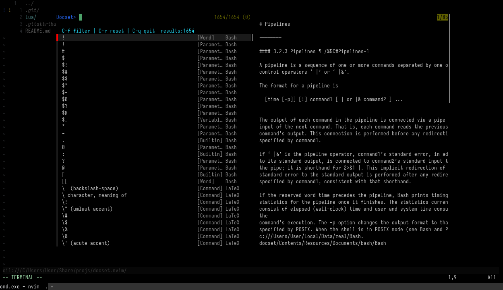

<div align="center">
  
</div>

# docset.nvim

Read Zeal/Dash docsets inside Neovim.

Authors: Kimi-K3🧙‍♂️, Kimi-K2.7-Code🧙‍♂️, scillidan🤡

- Fuzzy picker via [fzf-lua](https://github.com/ibhagwan/fzf-lua) (default) or [telescope.nvim](https://github.com/nvim-telescope/telescope.nvim)
- HTML preview through any terminal browser you configure
- Single reusable container: float / tab / split
- Multiple docs become buffers in the same container

## Requirements

- Neovim 0.10+
- Zeal/Dash docsets (`.docset`)
- [fzf-lua](https://github.com/ibhagwan/fzf-lua) (default) or [telescope.nvim](https://github.com/nvim-telescope/telescope.nvim)
- A terminal browser: [reader](https://github.com/mrusme/reader), [elinks](https://github.com/rkd77/elinks), [lynx](https://invisible-island.net/lynx/lynx.html), [w3m](https://invisible-island.net/lynx/lynx.html), etc.

## Install

```lua
{
  "scillidan/docset.nvim",
  dependencies = { "ibhagwan/fzf-lua" }, -- or "nvim-telescope/telescope.nvim"
  config = function()
    require("docset").setup({
    	-- Default options
      -- Multiple paths supported. Set it for your platform/install method:
      --   Linux: ~/.local/share/Zeal/Zeal/docsets
      --   Windows (scoop): ~/Scoop/apps/zeal/current/docsets
      --   Windows (official installer): ~/AppData/Local/Zeal/Zeal/docsets
      docset_dirs = { vim.fn.expand("~/AppData/Local/Zeal/Zeal/docsets") }, -- Required
      include_documents = {}, -- e.g. "Bash", "LaTeX"
      exclude_documents = {}, -- e.g. "Linux Man Pages"
      browser = "", -- "reader" or { { "reader", "--image-mode", "none" }, "elinks" }
      picker = "fzf", -- Or "telescope"
      highlights = {
        tab = "TabLine",
        tab_active = "TabLineSel",
        entry_type = "Comment",
        entry_docset = "Comment",
      },
      preview_max_lines = 200, -- 0 for unlimited
      window = {
        mode = { "float", { width = 0.8, height = 0.85 } }, -- Or
        -- mode = { "split", { position = "below" } },
        -- mode = { "vsplit", { position = "right" } },
        -- mode = { "tab" },
      },
    })
  end,
}
```

## Usage

```lua
vim.keymap.set("n", "<leader>D", "<Cmd>Docset<CR>", { desc = "Docset picker" })        -- open picker
vim.keymap.set("n", "<leader>d", "<Cmd>DocsetLookup<CR>", { desc = "Docset lookup word" })  -- lookup cursor word
vim.keymap.set("v", "<leader>d", function()
  local mode = vim.fn.visualmode()
  local word = vim.fn.getregion(vim.fn.getpos("'<"), vim.fn.getpos("'>"), { type = mode })[1]
  if word and word ~= "" then
    require("docset").lookup(word)
  end
end, { desc = "Docset lookup selection" })
```

### In the fzf picker

- Type `docset:`, `docset:type`, or `docset:type content` in the search box to filter. Multiple docsets/types separated by `,` (e.g. `lua,bash:function,guide ver`).
- `Enter` applies the filter when the query contains filter syntax (fzf), otherwise opens the selection.
- `C-f` applies the current query as a filter.
- `C-r` resets filters and the search text, back to the full entry list.
- Search matches entry names only; `docset` and `type` columns are matched via the filter syntax.
- Content search matches whole words in any order: `node 3` matches `Node3D`, `soft 3D` matches `SoftBody3D`

### In the browser

| Key | Action |
| :- | :- |
| `H` / `L` | Previous / next doc buffer |
| `d` | Close current doc buffer |
| `q` | Close reader container |
| `<Esc>` | Exit terminal mode |
| `<C-h>` / `<C-l>` | Switch buffer from terminal mode |
| `<C-d>` | Close current buffer from terminal mode |
| `<C-q>` | Close container from terminal mode |